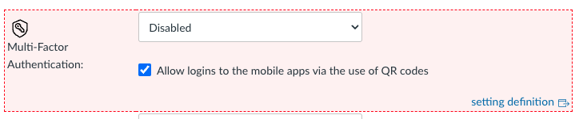

# CX-Tools

## Installation steps
In a browser add on like GreaseMonkey (FireFox) or TamperMonkey (Chrome) you can install the Javascript via following the instructions here:
[Tampermonkey FAQ](https://www.tampermonkey.net/faq.php?ext=gcal&show=gcal#Q102)

The URL to install from is:
https://raw.githubusercontent.com/clmcavaney/CX-Tools/master/canvasBetter.js

That URL points to a cached copy of the script.  The cached copy should update soon after any pushed change.

## Notes
When a setting is only visible to a SiteAdmin, it is highlighted like this:

Note that there is also reference to some internal documentation on what this setting is for.
